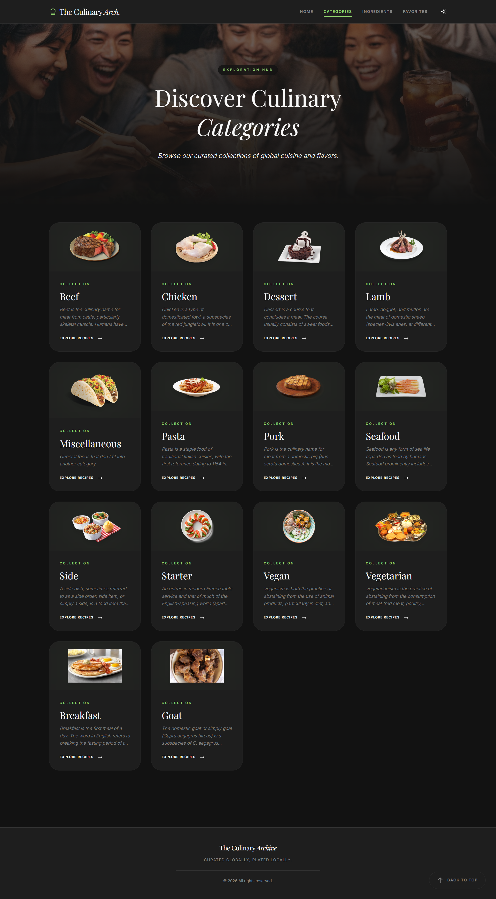
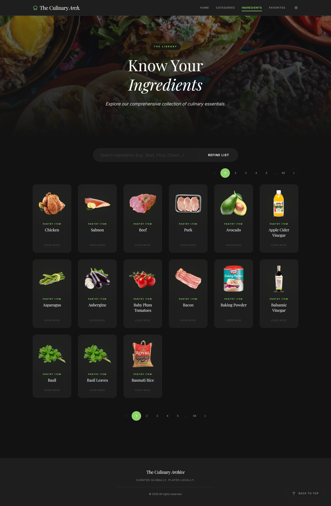

# Interactive Recipe Finder

[](https://reactjs.org/)
[](https://redux.js.org/)
[](https://tailwindcss.com/)
[](https://vitejs.dev/)

A stunning, responsive, and completely interactive recipe discovery application powered by React, Redux Toolkit, and TheMealDB API. 

**Live Deployment:** [theculinaryarchive.netlify.app](https://theculinaryarchive.netlify.app)

This project fulfills both the core requirements of a dynamic recipe search app and multiple "Bonus" features (filtering, random recipe generation, and advanced animations) all wrapped in a premium, highly-polished user experience.

---

## Application Gallery

*Click on any image below to view the full-length, high-resolution screenshot!*

<p align="center">
  <a href="./images/home_light.png"></a>
  <a href="./images/home_dark.png"></a>
</p>
<p align="center">
  <a href="./images/recipe%20details.png"></a>
  <a href="./images/search%20results.png"></a>
</p>
<p align="center">
  <a href="./images/favourite.png"></a>
</p>
<p align="center">
  <a href="./images/category.png"></a>
  <a href="./images/ingredients.png"></a>
</p>

---

## Design & Visual Architecture

The application was designed from the ground up to reflect a **"premium culinary"** editorial aesthetic, escaping the standard "dashboard" look of most technical projects.

- **Color Palette & Theming**: The primary brand color is a fresh, vibrant green (`#90d26d`), perfectly accented by warm culinary yellows (`#f7f1a8`) and soft golds (`#e5c287`). The application features a fully responsive global **Light/Dark Mode toggle**, allowing the app to switch smoothly from a clean `#f9f9f9` light theme to a deep charcoal `#121212` dark theme, ensuring high legibility and vivid imagery in any environment.
- **Structural Layout**: The UI utilizes a highly visual, card-based layout featuring modern "glassmorphism" (semi-transparent blurred panels). These panels float gracefully over dynamic, slow-panning background food imagery to create a profound sense of depth and luxury. 
- **Typography**: The font stack pairs the clean sans-serif sequence *Inter* for core UI legibility with the elegant serif *Playfair Display* for primary recipe titles, mimicking a high-end physical menu.

---

## Core & Bonus Features 

### Core Objectives Met
1. **Robust API Integration**: Synchronized with `TheMealDB` public API. Supports complex search routing by Main Ingredient, Recipe Name, Category, or Geographic Area.
2. **Comprehensive Recipe Views**: Clicking any recipe dynamically routes to a detailed, full-page view showcasing:
   - High-resolution dish imagery and automated Recipe Titles.
   - Exact ingredients lists with their corresponding measurements.
   - Step-by-step cooking instructions mapped structurally.
   - Categorical tags indicating the meal's Type and Regional Cuisine.
   - Embedded HD YouTube video tutorials corresponding to the exact recipe.
3. **Persisted Favorites System**: 
   - Users can instantly save/unsave recipes via the heart icon on any individual card.
   - A dedicated "Favorites" dashboard dynamically lists their entire collection. 
   - **Persistence**: Favorite state is abstracted via Redux and synchronized instantly to the browser's `localStorage`, ensuring favorites survive across full page reloads and browser restarts.
4. **Professional UI / UX**: 
   - **Mobile First**: Built with responsive layouts that scale flawlessly from ultra-wide desktop monitors down to mobile phones utilizing Tailwind CSS grid mathematics and flexbox.
   - Implements graceful loading spinners and visual skeleton loaders while fetching asynchronous data.
   - Handles API network failures or empty "No Results Found" queries gracefully with custom error toasts.
5. **Modern Tech Stack**:
   - Built on React 18 (Using Vite for rapid hot-module-reloading).
   - Designed exclusively using Functional Components and standard/custom React Hooks (`useState`, `useEffect`, `useMemo`, `useCallback`).
   - Abstracted complex global state management (Favorites, System Lookups) using **Redux Toolkit**.
   - Client-side navigation handled seamlessly by **React Router v6**.

### Bonus Objectives Met
- **Advanced Result Filtering**: On specific keyword searches, the client analyzes the local result set and dynamically generates accurate "Category" and "Cuisine" dropdown filters, allowing users to drill down deeper into the active results.
- **Dynamic Randomizer**: The Home dashboard prominently features a curated "Recipe of the Day" component that fetches and highlights a random meal upon every refresh.
- **Advanced Animations**: Custom CSS keyframes run globally, causing background images to slowly pan and zoom infinitely behind frosted UI elements, creating a living application background.

---

## Local Installation & Setup

To explore this project natively on your local machine:

**Prerequisites:** Ensure you have Node.js (`v16.0.0` or higher recommended) installed.

1. **Clone the repository** (or navigate to the extracted project directory):
   ```bash
   cd "interactive-recipe-finder"
   ```
2. **Install project dependencies**:
   ```bash
   npm install
   ```
3. **Start the local Vite development server**:
   ```bash
   npm run dev
   ```
4. **View the application**: Open your browser and navigate to the default port URL, typically `http://localhost:5173`.

---

## Engineering Challenges & Architectural Decisions

Rather than dumping all logic into React components, the architecture relies heavily on Custom Hooks to abstract heavy data transformations away from the declarative UI. Throughout development, several major challenges required custom engineering workarounds:

#### 1. Data Consistency (TheMealDB API Truncation Limitations)
- **The Challenge**: When querying TheMealDB by Category (e.g., "Seafood") or Geographic Area (e.g., "Canadian"), the returned JSON objects are artificially truncated. They contain *only* an ID, Name, and Thumbnail, entirely omitting the vital `strCategory` and `strArea` tags.
- **The Impact**: Because those tags are missing from the raw response, the client-side dropdown filters on the search page cannot accurately group or filter the results, theoretically breaking the Bonus "Filter by Cuisine" feature for those specific searches.
- **The Solution**: For smaller "Ingredient" searches, I engineered a bypass by mapping over the truncated results and firing off individual `lookup.php` requests by ID, using `Promise.all` to dynamically "stitch" the full data objects together client-side. This guarantees perfect data. Conversely, for massive Category/Area searches, triggering 70+ sequential lookups would instantly freeze the user's browser thread. In those specific scenarios, the client-side filters are intentionally and safely disabled to prioritize application stability and performance over features.

#### 2. Performance Optimization (API Over-Fetching & Spam)
- **The Challenge**: Because the core search function updates dynamically based on the URL, a user typing "Beef" or rapidly navigating utilizing the browser's "Back" button could easily trigger dozens of identical API requests, drastically slowing down the app and risking IP rate-limiting from the free, public API.
- **The Solution**: I engineered a custom `Map`-based caching layer directly inside the `recipeApi.js` service context. Before any `fetch` executes over the network, the service checks if the exact URL string exists in the local cache dictionary. If found, the request execution is intercepted and the data is served identically from RAM practically instantly, vastly improving the perceived speed of the app during rapid navigation.

#### 3. State Architecture ("Prop-Drilling")
- **The Challenge**: Under standard React Context patterns, passing the "Favorites" array or the massive global "Categories" lookup lists down through multiple layers of the application tree (from the top-level Router down to individual recipe cards) became incredibly messy, brittle, and difficult to maintain. 
- **The Solution**: I deployed **Redux Toolkit** to act as a singular "global bulletin board" for the application. Components that need to write to the favorites list (like a heart icon on a Recipe Card) isolate their logic by simply `dispatching` an action to the central slice. Meanwhile, completely disconnected components (like the Navbar's favorite counter badge) instantly synchronize with the new state using `useSelector`, entirely eliminating prop-drilling and coupling.
