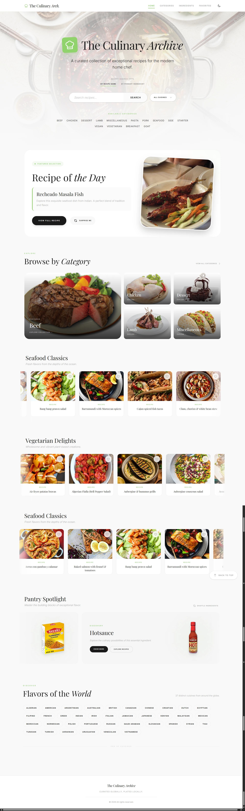
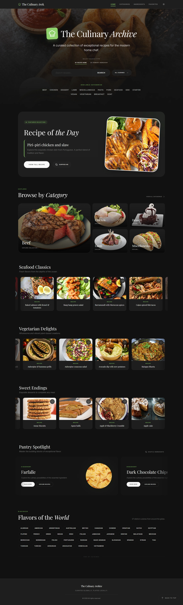
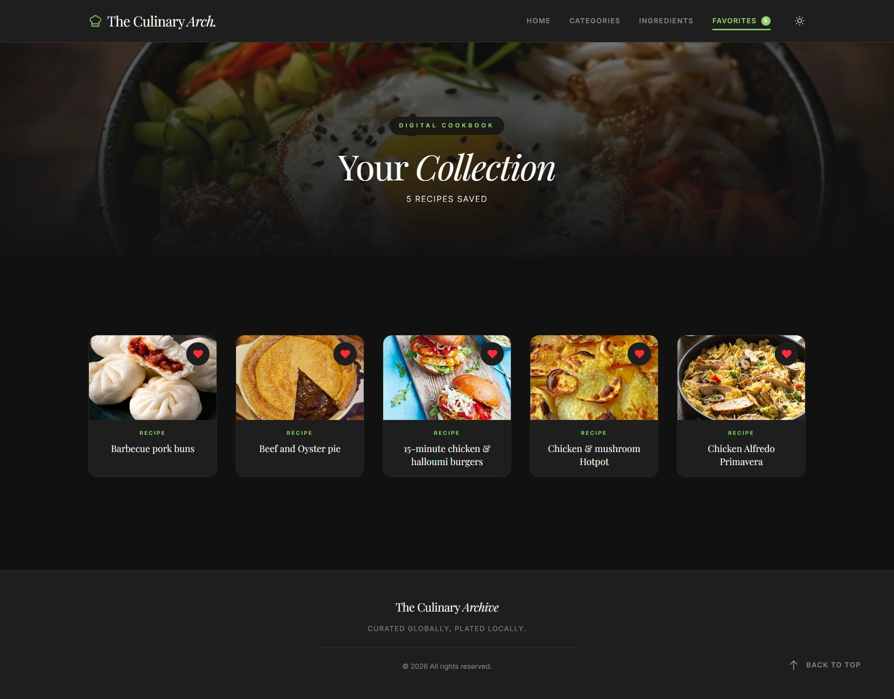
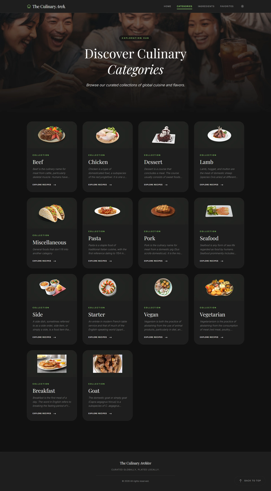
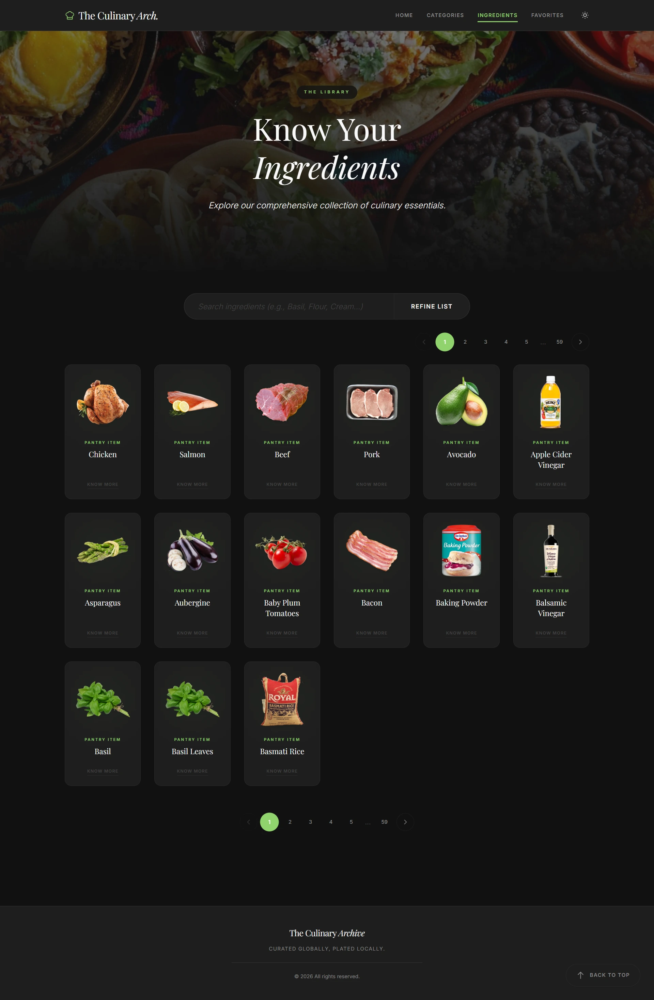

# Interactive Recipe Finder

[](https://reactjs.org/)
[](https://redux.js.org/)
[](https://tailwindcss.com/)
[](https://vitejs.dev/)

A stunning, responsive, and completely interactive recipe discovery application powered by React, Redux Toolkit, and TheMealDB API. 

**Live Deployment:** [theculinaryarchive.netlify.app](https://theculinaryarchive.netlify.app)

This project fulfills both the core requirements of a dynamic recipe search app and multiple "Bonus" features (filtering, random recipe generation, and advanced animations) all wrapped in a premium, highly-polished user experience.

---

## Application Gallery

*Click on any image below to view the full-length, high-resolution screenshot!*

<p align="center">
  <a href="./images/home_light.webp"></a>
  <a href="./images/home_dark.webp"></a>
</p>
<p align="center">
  <a href="./images/recipe%20details.webp"></a>
  <a href="./images/search%20results.webp"></a>
</p>
<p align="center">
  <a href="./images/favourite.webp"></a>
</p>
<p align="center">
  <a href="./images/category.webp"></a>
  <a href="./images/ingredients.webp"></a>
</p>

---

## Design & Visual Architecture

The application was designed from the ground up to reflect a **"premium culinary"** editorial aesthetic, escaping the standard "dashboard" look of most technical projects.

- **Color Palette & Theming**: The primary brand color is a fresh, vibrant green (`#90d26d`), perfectly accented by warm culinary yellows (`#f7f1a8`) and soft golds (`#e5c287`). The application features a fully responsive global **Light/Dark Mode toggle**, allowing the app to switch smoothly from a clean `#f9f9f9` light theme to a deep charcoal `#121212` dark theme, ensuring high legibility and vivid imagery in any environment.
- **Structural Layout**: The UI utilizes a highly visual, card-based layout featuring modern "glassmorphism" (semi-transparent blurred panels). These panels float gracefully over dynamic, slow-panning background food imagery to create a profound sense of depth and luxury. 
- **Typography**: The font stack pairs the clean sans-serif sequence *Inter* for core UI legibility with the elegant serif *Playfair Display* for primary recipe titles, mimicking a high-end physical menu.

---

## Core & Bonus Features 

### Core Objectives Met
1. **Robust API Integration**: Synchronized with `TheMealDB` public API. Supports complex search routing by Main Ingredient, Recipe Name, Category, or Geographic Area.
2. **Comprehensive Recipe Views**: Clicking any recipe dynamically routes to a detailed, full-page view showcasing:
   - High-resolution dish imagery and automated Recipe Titles.
   - Exact ingredients lists with their corresponding measurements.
   - Step-by-step cooking instructions mapped structurally.
   - Categorical tags indicating the meal's Type and Regional Cuisine.
   - Embedded HD YouTube video tutorials corresponding to the exact recipe.
3. **Persisted Favorites System**: 
   - Users can instantly save/unsave recipes via the heart icon on any individual card.
   - A dedicated "Favorites" dashboard dynamically lists their entire collection. 
   - **Persistence**: Favorite state is abstracted via Redux and synchronized instantly to the browser's `localStorage`, ensuring favorites survive across full page reloads and browser restarts.
4. **Professional UI / UX**: 
   - **Mobile First**: Built with responsive layouts that scale flawlessly from ultra-wide desktop monitors down to mobile phones utilizing Tailwind CSS grid mathematics and flexbox.
   - Implements graceful loading spinners and visual skeleton loaders while fetching asynchronous data.
   - Handles API network failures or empty "No Results Found" queries gracefully with custom error toasts.
5. **Modern Tech Stack**:
   - Built on React 18 (Using Vite for rapid hot-module-reloading).
   - Designed exclusively using Functional Components and standard/custom React Hooks (`useState`, `useEffect`, `useMemo`, `useCallback`).
   - Abstracted complex global state management (Favorites, System Lookups) using **Redux Toolkit**.
   - Client-side navigation handled seamlessly by **React Router v6**.

### Bonus Objectives Met
- **Advanced Result Filtering**: On specific keyword searches, the client analyzes the local result set and dynamically generates accurate "Category" and "Cuisine" dropdown filters, allowing users to drill down deeper into the active results.
- **Dynamic Randomizer**: The Home dashboard prominently features a curated "Recipe of the Day" component that fetches and highlights a random meal upon every refresh.
- **Advanced Animations**: Custom CSS keyframes run globally, causing background images to slowly pan and zoom infinitely behind frosted UI elements, creating a living application background.

---

## Local Installation & Setup

To explore this project natively on your local machine:

**Prerequisites:** Ensure you have Node.js (`v16.0.0` or higher recommended) installed.

1. **Clone the repository** (or navigate to the extracted project directory):
   ```bash
   cd "interactive-recipe-finder"
   ```
2. **Install project dependencies**:
   ```bash
   npm install
   ```
3. **Start the local Vite development server**:
   ```bash
   npm run dev
   ```
4. **View the application**: Open your browser and navigate to the default port URL, typically `http://localhost:5173`.

---

## 🧠 Engineering Challenges & Solutions

To keep the application clean and fast, I moved the complicated logic out of the visual components and into "Custom Hooks". Here are some specific problems I had to solve:


#### 1. Stopping API Spam (Caching)
- **The Challenge**: Every time a user types a letter in the search box or clicks the "Back" button, it can trigger a new API request. Doing this too fast sends identical requests over and over, slowing everything down.
- **The Solution**: I built a "cache" (a temporary memory bank). Before the app asks the internet for data, it checks the cache to see if we already searched for that exact thing recently. If we did, it loads the data instantly from local memory instead of waiting for the internet, making the app much faster.

#### 2. Organizing the App's Memory (Redux)
- **The Challenge**: Passing data (like the user's "Favorite Recipes") from the top of the app all the way down through multiple layers of components gets very messy and hard to manage. This is called "Prop-Drilling".
- **The Solution**: I used **Redux Toolkit** to create a single "Global Bulletin Board" for the app. Now, if a user clicks a "Heart" button on a recipe, it updates the bulletin board directly. Any other part of the app (like the Favorites counter at the top of the screen) can instantly see that update without needing a messy chain of data passing.

#### 3. Scroll Restoration
- **The Challenge**: When navigating from a long, scrolled-down search result list to a Recipe Detail page, the browser would preserve the scroll position, landing the user at the bottom of the new page.
- **The Solution**: I implemented a "Scroll to Top" mechanism using a `useEffect` hook in the `RecipeDetails` component. This ensures that every time a user opens a new recipe, the view is automatically reset to the top of the page for a seamless experience.


